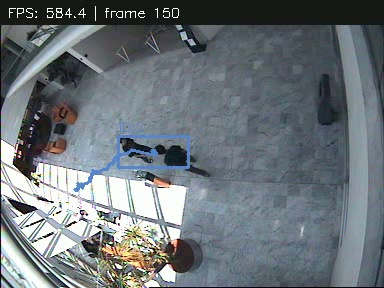

# Motion Tracking Analysis Pipeline

## 프로젝트 소개

OpenCV로 움직임을 감지하고 객체의 ID·궤적을 추적합니다.
MOG2, 거리 기반 매칭, ORB 재인식을 직접 구현하고 겹침·정지·조명 변화에서의 한계를 측정합니다.
딥러닝 모델과 `cv2.dnn`은 사용하지 않습니다.

## 핵심 특징

- 웹캠·영상 입력 → 검출 → 추적 → 박스·ID·궤적·FPS 표시
- 등록 이미지의 ORB 매칭·기하 검증을 통과하면 `TARGET DETECTED` 표시
- 화면 없는 분석, 선택적 MP4·CSV 저장
- 추적 30회, 학습률 3종, 동일 ALOI 물체 5조건과 실제 영상 보조 평가

## 아키텍처

핵심 코드는 `motion_tracking/`에 모았습니다. `app.py`가 `MotionDetector → Tracker → draw_overlay`를
호출하고, 등록 이미지가 있으면 `TargetMatcher`로 재인식합니다.

```text
.
├── app.py              # CLI · 프레임 루프
├── motion_tracking/    # 공용 핵심 모듈
│   ├── __init__.py
│   ├── config.py       # 기본 설정
│   ├── vision.py       # MOG2 · ORB
│   ├── tracker.py      # 거리 매칭 · ID · 궤적
│   ├── display.py      # 오버레이 · 키 제어
│   └── evaluation.py   # 정답 연결 · 지표
├── scripts/
│   ├── common.py       # 경로 · CSV 저장
│   ├── data/           # 다운로드 · 입력 준비
│   └── eval/           # 합성 시험 · 데이터셋 평가
├── tests/              # 회귀 테스트
├── data/               # 원본 · 출처 · 이용 조건
├── results/            # 측정 CSV · 캡처 · 검증 근거
└── docs/
    ├── report.md       # 평가 결과 · 한계 · 검증 방법
    └── review.csv      # 검토자별 관찰 기록
```

## 실행

Python 3.11 이상, 프로젝트 루트에서 실행합니다.

```bash
python3 -m venv .venv
source .venv/bin/activate
python -m pip install -r requirements-dev.txt

# 원본 영상이 없을 때만 다운로드
python -m scripts.data.download
python app.py --source data/raw/meeting.mpg --show-mask
```

Windows에서는 `.venv\Scripts\activate`로 활성화합니다.
웹캠은 `--source 0`, 표적 등록은 `--target 이미지경로`를 사용합니다.
키는 `q` 종료, `p` 정지·재개, `s` PNG 저장입니다.

```bash
python app.py --source data/raw/meeting.mpg --headless \
  --output results/videos/meeting.mp4 --csv results/traces/meeting.csv
```

옵션은 `python app.py --help`, 기본값은 `motion_tracking/config.py`에서 확인합니다.
표시 FPS는 처리 속도이며 원본 영상 FPS와 다릅니다.

## 평가와 검증

```bash
python -m scripts.eval.run             # 추적 30회 × 8설정 · 통제 실험
python -m scripts.eval.aloi            # 동일 물체의 특징점 매칭
python -m scripts.eval.lighting        # LASIESTA 조명 변화
python -m scripts.eval.natural_events  # LASIESTA 가림 · 정지
python -m pytest -q
```

### SIFT 사용 근거

SIFT는 `scripts/eval/aloi.py`의 `main()`에서 ALOI 비교 실험에 사용합니다.
`cv2.SIFT_create(nfeatures=1500)`로 초기화하고, 등록 이미지와 장면에
`detectAndCompute`를 호출합니다. `BFMatcher(cv2.NORM_L2).knnMatch(k=2)`로
대응점을 찾은 뒤 ratio test 0.75, 장면 특징점 중복 제거,
`findHomography(..., cv2.RANSAC, 3)`으로 인라이어를 측정합니다.

`python -m scripts.data.prepare`로 입력을 준비한 뒤 `python -m scripts.eval.aloi`로
재현합니다. 결과는 `results/aloi_features.csv`의 `SIFT_reference` 행에 저장됩니다.
앱의 표적 인식은 ORB이며, SIFT 비교 실험은 대응점·인라이어만 측정하므로
`found`는 비워 둡니다. 합성 패턴의 ORB 평가 결과와는 별도 실험입니다.

ALOI와 LASIESTA 5개 입력은 `python -m scripts.data.prepare`로 준비합니다.
RAR 해제에는 OS의 libarchive와 Python 패키지 `libarchive-c`가 필요합니다
(`python -m pip install libarchive-c`). CAVIAR 다운로드·평가는
`meeting`·`walking`·`stopping` 3개, LASIESTA 조명 평가는 `I_IL` 2개,
가림·정지 추적은 `I_OC`·`I_CA` 3개로 실행합니다.
ALOI 1,000개 전수평가는 범위에서 제외합니다.

기본 실행은 CSV·로그·대표 캡처를 저장합니다. 영상이 필요하면 `scripts.eval.run` 또는
`scripts.eval.natural_events`에 `--export-videos`를 추가합니다.
실제 영상 평가 출력은 `results/current/` 아래에 저장합니다:
CAVIAR는 `real_tracking.csv`·`real_objects.csv`·`video_metadata.csv`,
LASIESTA 조명은 `lasiesta_summary.csv`, 가림·정지는 `lasiesta_tracking.csv`입니다.
프레임 로그·캡처·선택적 영상도 같은 폴더의 `traces/`·`captures/`·`videos/`에 저장합니다.
합성 평가는 `results/`의 `tracking_trials.csv`·`tracking_summary.csv`·`synthetic_objects.csv`,
배경·특징점 평가는 `background.csv`·`features.csv`·`aloi_features.csv`에 저장합니다.
`run.json`은 `scripts.eval.run`의 실행 환경·설정·소요 시간입니다.
ALOI 필수 5조건은 `aloi_features.csv`에서 확인하며 별도 중복 CSV는 두지 않습니다.
`python -m scripts.eval.run --export-videos`는 합성 30시험 모두의 원본을 `data/clips/`,
동일 실행의 ID·프레임 번호가 표시된 관찰용 영상을 `results/videos/`에 저장합니다.
수동 측정은 `docs/review.csv`의 `needs_human_review` 행에 기록합니다.
겹침 시작·끝은 `overlap_start`·`overlap_end`, 자동 참고 계수는 실험 CSV의
`post_overlap_switches`입니다. 겹침 없는 조건은 해당 지표를 비워 둡니다.

## 결과와 데이터

[평가 보고서](docs/report.md)에 측정값·한계·검증 범위·수동 검토 방법을 모았습니다.
`docs/report.md`는 최종 산출물로 유지하며, 실험을 다시 실행해도 자동 갱신되지 않습니다.
보고서의 CAVIAR 결과는 현재 코드가 평가하는 `walking`·`meeting`·`stopping` 3개이며,
측정 근거는 `results/current/real_tracking.csv`입니다.
[검토 기록](docs/review.csv)에 기존 AI 참고 계수와 사람이 작성할 빈 측정 행을 구분했습니다.
사람의 독립적인 수동 전수계수는 미완료이며, 절차는 보고서의 검토 방법에 있습니다.
실물 웹캠과 실제 영상의 가림 비율·일부 GT 정렬도 추가 검증이 필요합니다.

원본 출처와 이용 조건은 [데이터 안내](data/NOTICE.md), 파일별 해시는 각 `sources.json`에 있습니다.
`data/download/`는 사용자가 가져온 원본 보관소입니다.
합성 영상·측정 CSV·추적 로그와 CAVIAR·LASIESTA 원본 및 분석 산출물은 공개 대상으로 둡니다.
외부 자료에는 데이터 안내의 출처·라이선스 조건을 유지합니다. `.gitignore`는
가상환경·캐시·비밀 설정과 재배포 허가가 확인되지 않은 ALOI 이미지·과제 원문만 제외합니다.


