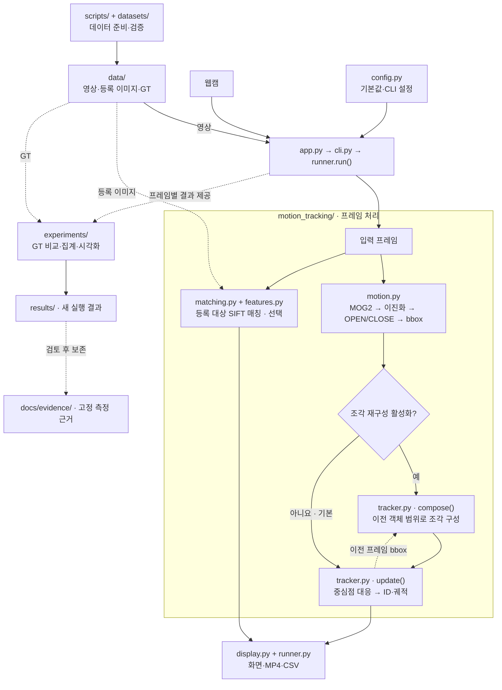

# Motion Tracking Analysis Pipeline

## 프로젝트 소개

OpenCV MOG2로 움직임을 검출하고 객체 ID·궤적을 추적하는 Python 앱입니다.
등록 대상은 별도의 전체 프레임 SIFT 매칭으로 찾습니다. 딥러닝은 사용하지 않습니다.

## 핵심 특징

- 웹캠·영상 입력, GUI 타임라인, 마스크 표시, headless 실행, MP4·CSV 저장
- 추적·학습률·대상 매칭을 실제 앱 경로로 평가하고 측정 근거 보존
- 전경 조각 재구성 실험 지원. 교차·가림 회귀가 있어 **기본 비활성화**

현재 구조로 신체 분리·정지·사람 간 겹침을 함께 안정적으로 해결하지 못했습니다.
측정 결과와 한계는 [분석 보고서](docs/report.md)에 정리했습니다.

## 아키텍처


```mermaid
flowchart TD
    Setup["scripts/ + datasets/<br/>데이터 준비·검증"] --> Data["data/<br/>영상·등록 이미지·GT"]
    Data -- "영상" --> App["app.py → cli.py → runner.run()"]
    Camera["웹캠"] --> App
    Config["config.py<br/>기본값·CLI 설정"] --> App

    subgraph Pipeline["motion_tracking/ · 프레임 처리"]
        Frame["입력 프레임"] --> Motion["motion.py<br/>MOG2 → 이진화 → OPEN/CLOSE → bbox"]
        Motion --> Compose{"조각 재구성 활성화?"}
        Compose -- "예" --> Group["tracker.py · compose()<br/>이전 객체 범위로 조각 구성"]
        Compose -- "아니요 · 기본" --> Track["tracker.py · update()<br/>중심점 대응 → ID·궤적"]
        Group --> Track
        Track -. "이전 프레임 bbox" .-> Group
        Frame --> Match["matching.py + features.py<br/>등록 대상 SIFT 매칭 · 선택"]
    end

    App --> Frame
    Data -. "등록 이미지" .-> Match
    Track --> Output["display.py + runner.py<br/>화면·MP4·CSV"]
    Match --> Output
    App -. "프레임별 결과 제공" .-> Eval["experiments/<br/>GT 비교·집계·시각화"]
    Data -. "GT" .-> Eval
    Eval --> Results["results/ · 새 실행 결과"]
    Results -. "검토 후 보존" .-> Evidence["docs/evidence/ · 고정 측정 근거"]
```

검출·추적·SIFT는 앱에만 구현합니다. `experiments/`는 같은 `runner.run()`의 결과를 평가합니다.
SIFT 매칭은 추적 ID와 독립적이며 전경 마스크를 보정하지 않습니다.

## 설치·데이터 준비

Python 3.11 이상. 저장소 루트에서 실행합니다.

```bash
python3 -m venv .venv
source .venv/bin/activate
python -m pip install -r requirements.txt
python scripts/01_setup_data.py
python scripts/02_verify_data.py
```

Windows 활성화 명령은 `.venv\Scripts\activate`입니다. 원본 RAR 재구성에는 OS `libarchive`가 필요합니다.
기존 입력은 검증 후 유지하며, tracker·matcher 원본과 평가 GT를 준비합니다.
오프라인 검사는 `--offline`, 준비 범위는 `--purpose tracker|matcher|detection`으로 지정합니다.

Oxford 영상·등록 이미지는 직접 `data/detection/raw/town_centre.mp4`와
`data/detection/inputs/target.png`에 배치합니다. 원본·파생물은 로컬 전용이며
[데이터 출처·사용 조건](data/NOTICE.md)을 따릅니다.

## 실행

```bash
python app.py --source data/tracker/inputs/11.mp4 --show-mask
python app.py --source data/matcher/inputs/jogging.mp4 --target data/matcher/inputs/target.png
python app.py --source data/tracker/inputs/11.mp4 --headless --output results/tracking.mp4 --csv results/tracks.csv
python app.py --help
```

`--source 0`은 기본 웹캠입니다. `q` 종료, `p` 일시정지·재개, `s` 스냅샷 저장을 지원합니다.
타임라인 탐색은 MOG2와 추적 ID를 초기화합니다. 같은 추적 결과를 반복 확인하려면 저장한 MP4를 재생하세요.
화면 없는 환경에서는 `--headless`를 사용합니다. 출력 경로는 실행마다 다르게 지정하세요.

| 문서 | 내용 |
| --- | --- |
| [실행·평가 가이드](docs/recipes/tracker.md) | 설정, 영상별 관찰 구간, 실험 재현 명령 |
| [분석 보고서](docs/report.md) | 전경 분리 원인, 개선·회귀, 기존 측정, 다음 대안 |
| [결과 파일 안내](results/README.md) | 출력 구조와 덮어쓰기 동작 |
| [보존 근거 목록](docs/evidence/README.md) | 고정 CSV·이미지·환경 기록 |

## 개발 검증

```bash
python -m pip install -r requirements-dev.txt
python -m pytest -q
python -m ruff check .
```

단위·회귀 테스트와 실제 영상의 품질 평가는 별개입니다.
