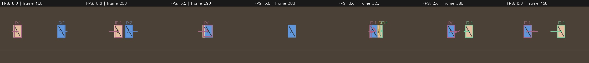
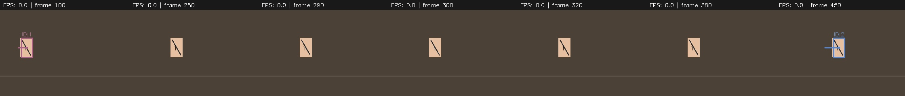
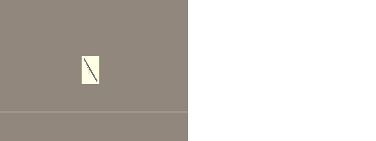
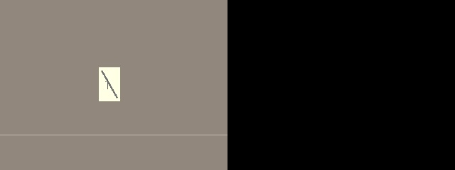
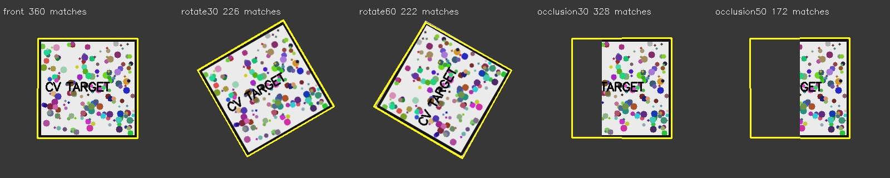
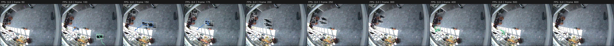
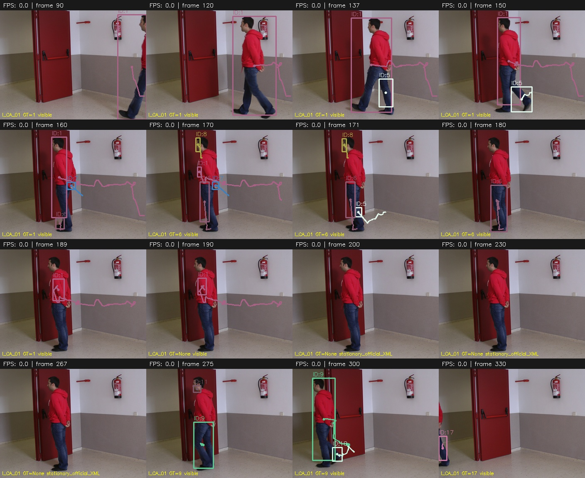
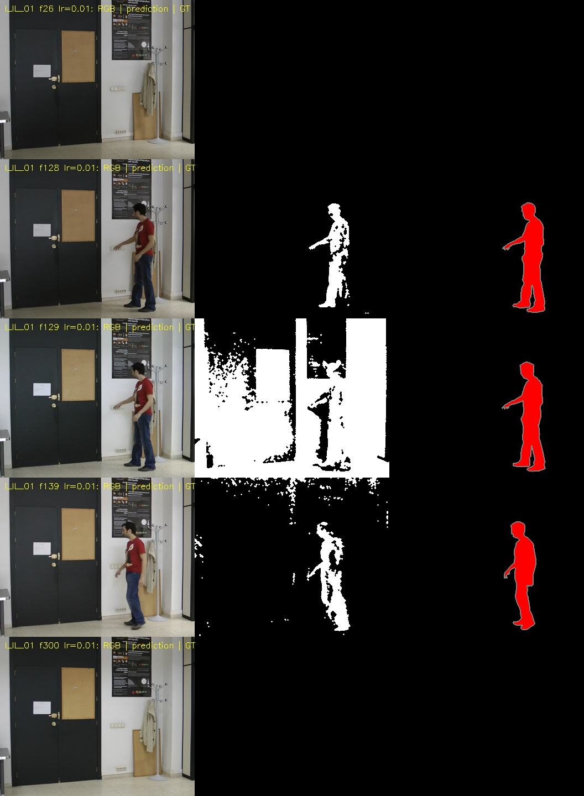
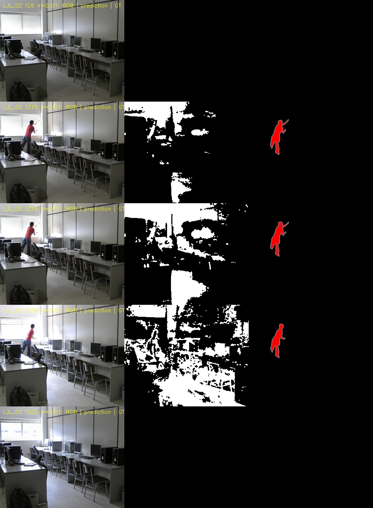

# 영상 움직임 추적 및 한계 분석 보고서

MOG2·거리 기반 Tracker·ORB를 평가한 결과, 단일 이동보다 겹침·정지·조명 변화에서 실패가 증가했다.
아래 수치는 자동 측정이며 **사람의 수동 전수계수는 미완료**다. 실행·설정은 [README](../README.md), 수동 측정 절차는 마지막 절에 있다.

## 평가 범위와 측정 기준

- 통제 추적: 단일 이동·겹침 각 10회, 정지·조명 변화 각 5회. 시험마다 초기화하며 경로·물체 폭·위치를 변형한다.
- 공개 자료: CAVIAR 3개, LASIESTA 조명 2개·가림 및 정지 3개, ALOI 물체 1개(전수평가 제외).
- 환경: Python 3.12.3, OpenCV 4.13.0, NumPy 2.4.3, CPU·OpenCV 스레드 1개, seed 42.
- 기본값: learning_rate=0.01, min_area=80px², kernel=3, max_distance=50px, max_missing=15, warmup=25프레임.

합성 시험은 각각 320×240, 25FPS, 625프레임(25초)이며 대상이 있는 f50~574를 평가한다.
프레임 번호는 0부터 시작하고 범위 양끝을 포함한다. 원래 프레임 배열에서 측정하므로 관찰용 MP4를 재분석하면 압축으로 결과가 달라질 수 있다.
같은 환경의 통제 변형 30회로, 독립적인 현장 표본이나 모집단 성능으로 일반화하지 않는다.

| 지표 | 정의 |
| --- | --- |
| 정답 연결 | 실제 검출 박스와 GT를 IoU ≥ 0.1, 최대 겹침 순서로 일대일 연결. 일부 신체 검출을 허용하는 낮은 임계값으로 결과에 영향을 준다. 보존 중인 미검출 track은 검출로 세지 않는다. |
| 전체 ID 변경 (`id_switches`) | 처음 ID가 5연속 프레임 확정된 뒤 다른 ID가 5연속 프레임 유지되면 1회. 재등장 시 번호 단절도 포함하며 엄밀한 객체 간 ID 교환만을 뜻하지 않는다. |
| 겹침 이후 ID Switch (`post_overlap_switches`) | 겹침 직전 마지막 확정 ID와 비교해, 완전 분리 다음 프레임부터 다른 ID가 5연속 프레임 유지되면 1회. 이후 추가 변경도 같은 기준으로 센다. 기준 ID가 없으면 첫 ID는 세지 않는다. |
| 추적 실패 | 평가 가능한 대상의 미검출·ID 미부여가 10연속 프레임 이상인 구간당 1회. 재검출 전까지는 길어져도 1회다. |
| 가림 제외 | 합성 GT의 정확한 면적으로 50% 이상 가려진 물체를 연결 후보·실패 분모에서 제외한다. 제외는 연속 실패·변경 후보를 끊고 마지막 확정 ID는 보존한다. 일반 미검출도 새 ID 연속 확인을 끊는다. |
| 실패율 / 미검출 프레임률 | 실패가 있는 시험 수 / 시험 수, 미검출 객체-프레임 / 평가 가능 객체-프레임 |

ID 변경·실패 구간은 객체별 합계라 시험 수보다 클 수 있다. 초기 학습 구간은 제외한다.
합성 겹침은 GT 사각형 교집합이 있는 구간(`overlap_start`~`overlap_end`)이며 시험당 1이벤트다.
이는 50% 가림 제외 구간과 다르다. 겹침 전·도중 ID 변경은 겹침 이후 지표에 넣지 않으며 분리 후 연속 확인을 새로 시작한다.
겹침 없는 조건의 해당 지표는 **해당 없음(빈 CSV)**이지 0회가 아니다. 실제 영상의 겹침·가림은 별도 확인해야 한다.

근거: `results/tracking_trials.csv`의 영상명·조건·프레임 범위·계수·메모,
`tracking_summary.csv`의 집계, `synthetic_objects.csv`의 객체별 결과, `results/traces/`의 프레임별 연결·가림 제외 기록.

## 추적 성능과 거리 기반 방식의 한계

| 상황 | 테스트 횟수 | 겹침 이후 ID Switch | 전체 ID 변경(참고) | 추적 실패 구간 | 실패한 시험 | 실패율 | 미검출 프레임률 |
| --- | --- | --- | --- | --- | --- | --- | --- |
| 단일 객체 이동 | 10 | 해당 없음 | 0 | 0 | 0 | 0% | 0.00% |
| 두 객체 겹침 | 10 | 24 | 27 | 7 | 7 | 70% | 5.45% |
| 객체 일시 정지 | 5 | 해당 없음 | 5 | 5 | 5 | 100% | 28.76% |
| 조명 변화 | 5 | 해당 없음 | 3 | 10 | 5 | 100% | 7.39% |

겹침 01~10번의 겹침 이후 계수는 2·2·3·2·2·4·2·2·3·2회다. 미션 기준 24회와 전체 ID 변경 27회를 혼용하지 않는다.
두 윤곽선이 합쳐지면 중심점 하나만 남고, 분리 후에는 거리만으로 이전 정체성을 구분할 수 없다.
`crossing_01`은 ID 1·2가 분리 후 1·4가 되어 파란 물체의 정체성을 유지하지 못했다.
정지 시험에서는 물체가 배경에 흡수되어 사라졌다가 재이동 시 새 ID를 받았다.

캡처는 f100·250·290·300·320·380·450을 비교한다. 실험 오버레이의 FPS=0은 속도 측정을 끈 표시다.

### 모폴로지·규칙 추가 실험

열림은 점 노이즈를 제거하고 닫힘은 구멍·틈을 메운다. 타원형 커널 1은 사실상 무처리이며 7은 작은 전경을 지우거나 가까운 영역을 합칠 수 있다.
센서 잡음이 거의 없는 통제 배경에서는 잡음 제거보다 형상 손실의 영향이 클 수 있다.

| 설정 | 겹침 ID 변경 | 겹침 실패 구간 | 정지 실패 구간 | 조명 실패 구간 |
| --- | --- | --- | --- | --- |
| baseline | 27 | 7 | 5 | 10 |
| lr_0.001 | 20 | 20 | 5 | 5 |
| lr_0.1 | 0 | 30 | 5 | 5 |
| kernel_1 | 20 | 13 | 5 | 10 |
| kernel_7 | 0 | 40 | 8 | 5 |
| distance_20 | 27 | 7 | 5 | 10 |
| distance_80 | 27 | 7 | 5 | 10 |
| velocity | 41 | 7 | 5 | 10 |

각 설정은 나머지 값을 고정하고 같은 30시험을 다시 실행했다. ID 열은 전체 ID 변경이다.
학습률(0.001/0.1), 커널(1/7), 연결 거리(20/80px), 마지막 속도 기반 위치 예측을 비교했다.
상세 근거는 `results/tracking_summary.csv`·`background.csv`다.

학습률 0.1은 평가 가능한 객체-프레임을 100%, 커널 7은 겹침에서 97.51% 놓쳤다. 따라서 ID 변경 0회는 개선이 아니다.
거리 20/50/80px 결과는 같았고 속도 예측은 변경을 27회에서 41회로 늘렸다.
좁은 거리 제한은 오연결을 줄이는 대신 빠른 이동·재등장을 새 ID로 만들기 쉽고, 넓은 제한은 오래된 ID에 잘못 연결하기 쉽다.
속도 예측도 겹침 중 잘못 연결한 중심점과 방향 전환에 취약하다. **위치만으로 객체를 구분할 수 없는 경우는 규칙 추가만으로 해결되지 않는다.**

## 배경 모델 학습률의 한계

MOG2는 픽셀별 가우시안 혼합으로 배경을 모델링하고 분포에 맞지 않는 값을 전경으로 분리한다.
`새 배경 ≈ (1−α)×기존 배경 + α×현재값`은 학습률의 직관이며 MOG2 전체 수식은 아니다.
학습률은 `apply`에 명시했다. 아래는 커널 3, f300~399의 전체 이미지 대비 평균 전경 비율이다.

| 학습률 | 정지: 전경 비율 | 조명 변화: 전경 비율 |
| --- | --- | --- |
| 0.001 | 0.31% | 97.59% |
| 0.01 | 0.07% | 10.36% |
| 0.1 | 0.00% | 0.00% |

0.001은 정지 물체를 오래 유지하지만 조명 변화의 배경 오검출·잔상이 오래 남는다.
0.1은 빠른 변화에 적응하지만 느린 이동·정지 물체도 빨리 흡수한다. 학습률 하나로 두 문제를 동시에 해결할 수 없다.
조명 급변의 대형 마스크를 최대 면적 필터로 제거해도 실제 대상 추적은 실패할 수 있다.
그림자 127을 제거하고 전경 255만 남기면 그림자 잡음은 줄지만 어두운 물체 일부도 손실될 수 있다.
초기부터 정지한 사람은 배경으로 학습되므로 warmup 증가만으로 검출을 해결하지 못한다.

## 특징점 매칭 성능과 한계

### 동일 실물 target의 필수 5조건

등록 이미지는 ALOI 물체 1의 `1_r0.png`(768×576)로 고정했다. `results/aloi_features.csv`의
`r0`·`r30`·`r60`·`occlusion30`·`occlusion50` 행이 근거이며 `python -m scripts.eval.aloi`로 재현한다.
매칭률은 **매칭 수 / 등록 특징점 수 × 100**이다. ORB는 앱의 기하 검증까지, SIFT는 대응점·인라이어만 비교한다.
두 방법 모두 ratio 0.75·장면 특징점 중복 제거·RANSAC 3px을 적용한다. SIFT의 앱 인식은 평가하지 않는다.

| 조건 | 방법 | 등록 특징점 | 장면 특징점 | 매칭 수 | 매칭률 | 앱 인식 |
| --- | --- | --- | --- | --- | --- | --- |
| 정면 | ORB_app | 907 | 932 | 687 | 75.74% | 1 |
| 정면 | SIFT_reference | 127 | 127 | 126 | 99.21% | 해당 없음 |
| 30° 회전 | ORB_app | 907 | 998 | 17 | 1.87% | 0 |
| 30° 회전 | SIFT_reference | 127 | 155 | 18 | 14.17% | 해당 없음 |
| 60° 회전 | ORB_app | 907 | 1134 | 2 | 0.22% | 0 |
| 60° 회전 | SIFT_reference | 127 | 171 | 8 | 6.30% | 해당 없음 |
| 30% 가림 | ORB_app | 907 | 835 | 510 | 56.23% | 1 |
| 30% 가림 | SIFT_reference | 127 | 117 | 88 | 69.29% | 해당 없음 |
| 50% 가림 | ORB_app | 907 | 629 | 328 | 36.16% | 1 |
| 50% 가림 | SIFT_reference | 127 | 86 | 51 | 40.16% | 해당 없음 |

정면은 자기 매칭, 30°/60°는 실제 촬영 시점 변화다. 모든 장면에 80px 검은 여백을 넣고 등록 해상도는 유지했다.
가림은 정면 마스크 전경 113,523픽셀을 왼쪽부터 회색 커튼으로 덮은 통제 변형이다.
30%는 34,057픽셀(30.000088%), 50%는 56,762픽셀(50.000440%)로 가장 가까운 정수 면적을 사용했다. 전체 사진·bbox 면적 기준이 아니다.

ORB는 30°/60°에서 실패했지만 30%/50% 가림에서는 인식을 유지했다. r30은 인라이어 11개도 모든 기하 조건을 통과하지 못했다.
물체 1개·조건당 1장 결과로 일반적인 성공률이나 SIFT 우위를 주장하지 않는다.

### 합성 패턴: 조건별 10장면

180×180 평면 패턴을 320×320 장면의 서로 다른 위치에 넣었다.
앱은 ORB 최대 1,500개·Hamming kNN·ratio 0.75·일대일 정리 후 RANSAC(3px)으로 인라이어 ≥8개·비율 ≥50%와
투영 사각형의 유한 좌표·볼록성·면적을 확인한다.

| 조건 | 등록 특징점 | 장면 특징점 평균 | 매칭 평균 | 인라이어 평균 | 매칭률 | 인식 성공 |
| --- | --- | --- | --- | --- | --- | --- |
| 정면 | 648 | 1434.4 | 344.2 | 341.1 | 53.12% | 10/10 |
| 평면 내 30° 회전 | 648 | 1440.7 | 224.4 | 216.9 | 34.63% | 10/10 |
| 평면 내 60° 회전 | 648 | 1435.7 | 222.3 | 218.9 | 34.31% | 10/10 |
| 30% 가림 | 648 | 1368.6 | 311.8 | 310.0 | 48.12% | 10/10 |
| 50% 가림 | 648 | 1159.4 | 163.4 | 162.1 | 25.22% | 10/10 |

30°/60°는 평면 내 회전이며 3차원 시점 변화가 아니다. 가림은 패턴 왼쪽 면적을 배경색으로 덮었다.
매칭률이 낮아져도 기하학적으로 일관된 특징이 남아 모든 조건에서 10/10 인식했다. 단일 패턴의 결과를 임의 실물로 일반화하지 않는다.

ORB/SIFT는 회전 불변성을 의도했으므로 회전·가림이 항상 실패를 뜻하지 않는다.
ORB는 추정 방향에 맞춰 BRIEF 샘플링을 회전시키지만 보간·검출 위치·방향 오차로 대응점이 줄고, 가림은 특징 자체를 없앤다.
원근·흐림·반사·비평면 변형·반복 무늬도 실패 원인이다. rBRIEF 비교쌍 선택에는 통계적 학습이 있지만,
현재 앱은 물체 정체성·환경별 외형을 학습하지 않아 새로운 재질·시점에 안정적으로 일반화하지 못한다.
합성 표는 ORB만, SIFT는 별도 ALOI 실험으로 측정했다.

파일 재생 표적 데모는 대상이 존재하는 f50~574의 525프레임에서 발견했고 전체 625프레임을 처리했다.
저장 포함 평균 73.1FPS였으며, 525/625는 정확도가 아니다. 별도 자연영상의 일반적인 오탐률은 미측정이다.

## 실제 영상·사진 보조 평가

### CAVIAR: 겹침·정지

`walking`(Walk1), `meeting`(Meet_WalkSplit), `stopping`(OneStopNoEnter1cor)을 편집 없이 전체 평가하고 영상마다 MOG2·Tracker를 초기화했다.
모두 20~30초이며 필수 겹침 영상은 `meeting.mpg`(24.96초)다. XML의 모든 사람을 집계하므로 `walking`도 단일 객체 전용 시험이 아니다.

| 영상 | 길이(초) | 디코딩/XML 프레임 | ID 변경 | 실패 구간 | 미검출률 |
| --- | --- | --- | --- | --- | --- |
| walking | 24.48 | 612/611 | 3 | 11 | 77.50% |
| meeting | 24.96 | 624/623 | 3 | 22 | 77.13% |
| stopping | 29.0 | 725/725 | 18 | 18 | 74.13% |

**50% 실제 가림 보정 전 참고 수치**다. MPEG 프레임 번호와 XML을 그대로 연결하고 정답 없는 마지막 프레임을 제외했다.
`walking`·`meeting`의 1프레임 차이가 끝에만 있다는 보장은 없어 전수 정렬도 미검증이다.
고정 구조물 가림·초기 정지 인물·작은 원거리 대상이 미검출에 영향을 준다. 합성 30시험에 합산하지 않는다.
근거는 `results/current/`의 `real_tracking.csv`·`real_objects.csv`·`video_metadata.csv`다.

### LASIESTA: 가림·정지

| 영상 | 학습률 | 확정 ID 변경 | 누락 구간 | 누락/평가 가능 프레임 | 정지 중 누락/정지 프레임 |
| --- | --- | --- | --- | --- | --- |
| I_OC_01 | 0.001 | 1 | 0 | 11/139 | 해당 없음 |
| I_OC_01 | 0.01 | 1 | 1 | 21/139 | 해당 없음 |
| I_OC_01 | 0.1 | 0 | 2 | 139/139 | 해당 없음 |
| I_OC_02 | 0.001 | 2 | 0 | 1/144 | 해당 없음 |
| I_OC_02 | 0.01 | 5 | 0 | 3/144 | 해당 없음 |
| I_OC_02 | 0.1 | 0 | 2 | 144/144 | 해당 없음 |
| I_CA_01 | 0.001 | 4 | 0 | 2/256 | 0/68 |
| I_CA_01 | 0.01 | 3 | 1 | 90/256 | 68/68 |
| I_CA_01 | 0.1 | 0 | 1 | 256/256 | 68/68 |

I_OC_01/I_OC_02/I_CA_01 전체 250/250/350프레임을 사용하고 영상·학습률마다 Tracker를 초기화했다.
첫 25프레임과 가시 GT 없는 구간을 제외했다. 정확한 가림 면적 라벨이 없어 50% 제외 기준을 적용하지 않은 보조 평가다.
공식 XML의 I_CA_01 정지 f200~267(68프레임)에서 0.001은 검출을 유지했고 0.01/0.1은 모두 누락했다.
정지 중 평균 전경 Recall은 약 78.5%/0%/0%였다. 근거는 `results/current/lasiesta_tracking.csv`다.
`python -m scripts.eval.natural_events --export-videos`의 25FPS MP4는 관찰용이며 원본 FPS·20~30초 촬영 증거가 아니다.

### LASIESTA: 조명 변화

I_IL_01은 전등 켜기, I_IL_02는 블라인드 열기·퇴장으로 후자는 영구 배경 변화도 포함한다.
352×288 원본 300/525프레임을 사용했다. 원본 FPS 미확인으로 초 단위 길이는 주장하지 않는다.
학습률만 바꾸고 MOG2를 초기화하며 첫 25프레임을 제외했다. 그림자 제거·3×3 열림·닫힘은 앱과 같다.
GT 빨강·초록·노랑·흰색(정지 물체)은 전경, 검정은 배경이며 불확실한 회색 128은 분모에서도 제외했다.

| 영상 | 학습률 | Precision | Recall | F1 | 배경 오검출률 | 회복 지연(프레임) |
| --- | --- | --- | --- | --- | --- | --- |
| I_IL_01 | 0.001 | 0.0626 | 0.9714 | 0.1175 | 0.2839 | 133 |
| I_IL_01 | 0.01 | 0.2774 | 0.8308 | 0.4159 | 0.0422 | 39 |
| I_IL_01 | 0.1 | 0.8388 | 0.0004 | 0.0009 | 0.0000 | 0 |
| I_IL_02 | 0.001 | 0.1447 | 0.8627 | 0.2478 | 0.1397 | 156 |
| I_IL_02 | 0.01 | 0.5076 | 0.6333 | 0.5635 | 0.0168 | 20 |
| I_IL_02 | 0.1 | 0.7294 | 0.0005 | 0.0011 | 0.0000 | 0 |

전체 픽셀 혼동행렬 합계로 Precision=TP/(TP+FP), Recall=TP/(TP+FN), F1=2TP/(2TP+FP+FN), 배경 오검출률=FP/(FP+TN)을 계산한다.
F1은 픽셀 분할 성능이며 ID 유지율이 아니다. f26 이후 평균 회색 밝기의 인접 프레임 차이가 최대인 f129/f216부터
배경 오검출률 ≤1%가 10연속 프레임 유지되기 시작할 때까지를 회복 지연으로 정의했다. 블라인드 변화 전체를 한순간으로 간주한 지표는 아니다.

0.001은 대상 Recall을 유지하지만 배경 오검출 회복이 느렸다. 0.01의 F1이 가장 높았고,
0.1은 배경을 빨리 안정시키면서 사람 Recall도 거의 0으로 만들었다. 빠른 배경 적응을 추적 개선으로 해석하거나 다른 카메라의 최적값으로 일반화하지 않는다.
근거는 `results/current/lasiesta_summary.csv`와 `traces/`다.

### ALOI: 조명 방향·색온도

필수 5조건과 같은 등록 물체로 조명 방향(l1c1/l8c1)과 색온도(i110/i250)를 비교했다.

| 조건 | 방법 | 등록/장면 특징점 | 매칭 | 인라이어 | 매칭률 | 앱 인식 |
| --- | --- | --- | --- | --- | --- | --- |
| l1c1 | ORB_app | 907/1448 | 11 | 4 | 1.21% | 0 |
| l1c1 | SIFT_reference | 127/260 | 3 | 0 | 2.36% | 해당 없음 |
| l8c1 | ORB_app | 907/1021 | 499 | 483 | 55.02% | 1 |
| l8c1 | SIFT_reference | 127/145 | 91 | 89 | 71.65% | 해당 없음 |
| i110 | ORB_app | 907/996 | 490 | 474 | 54.02% | 1 |
| i110 | SIFT_reference | 127/133 | 88 | 87 | 69.29% | 해당 없음 |
| i250 | ORB_app | 907/933 | 569 | 553 | 62.73% | 1 |
| i250 | SIFT_reference | 127/123 | 105 | 105 | 82.68% | 해당 없음 |

ORB는 l1c1에서 실패하고 나머지에서 성공했다. 비평면 물체에 대한 호모그래피 모델, 마스크 경계와 한 방향 가림에는 한계가 있다.
확인 그림은 `data/aloi/raw/evaluation.jpg`로 재생성한다. 데이터 출처·이용 조건은 [데이터 안내](../data/NOTICE.md), 해시는 각 `sources.json`에 있다.

## CCTV 대응과 딥러닝 필요성

| 조건 | 현재 실패 원인 | 운영 대응 |
| --- | --- | --- |
| 낮은 시점·밀집 통로 | 사람끼리 윤곽선 합침·장시간 가림 | 카메라 높이·시야 조정, 서로 보완하는 시점 확보 |
| 원거리·작은 사람 | 면적 필터·모폴로지로 소실 | 관심 영역별 크기 조정, 충분한 해상도 확보 |
| 자동 노출·역광·조명 켜짐 | 배경 전체가 전경으로 변함 | 노출/화이트밸런스 안정화, 조명 변화 구간 구분 |
| 카메라 흔들림 | 모든 배경이 움직임으로 검출 | 고정 마운트, 영상 안정화 후 검출 |
| 정지·재등장 | 배경 흡수·ID 수명 만료 | 정지 물체 검출과 재식별을 별도 설계 |

- **외형을 학습하면 겹침 문제가 해결될까?** 위치만으로 잃은 정체성을 탐지·Re-ID 외형 비교로 보완할 수 있다.
  같은 사람의 여러 시점·가림 전후, 구분하기 어려운 다른 사람 쌍과 연속 ID 라벨이 필요하다. 완전 가림·같은 옷·저해상도에서는 해결을 보장하지 못한다.
- **다양한 변형을 학습하면 매칭이 개선될까?** 회전·원근·흐림·가림 증강과 학습된 특징으로 대응점 안정화를 기대한다.
  실제 재질·시점·비평면 변형을 포함하고 학습에 없는 물체·장소로 일반화를 평가해야 한다.
- **환경 변화를 학습하면 배경 모델링이 강건해질까?** 객체 의미를 학습한 탐지·분할은 밝기 변화 중에도 대상 검출을 도울 수 있다.
  주야간·역광·그림자·카메라별 노출·빈 장면·정지 대상과 라벨이 필요하며 현장별·시간 분리 검증으로 환경 변화에 따른 성능 저하를 확인해야 한다.

실험에서 드러난 정체성 손실·시점 변화·배경 흡수를 보완하기 위한 제안이며, 딥러닝·dnn·MediaPipe 구현이나 개선 성능 측정은 하지 않았다.

## 검증과 수동 검토

### 구현·검증 근거

`motion_tracking/tracker.py`는 NumPy 거리 행렬의 일대일 greedy 매칭, 신규 증가 ID,
`max_missing` 초과 시 삭제와 궤적을 관리하며 `app.py` 루프에 연동된다.
배경 분리·검출·매칭은 `vision.py`, 키·표시는 `display.py`, 기본 파라미터는 `config.py`로 분리했다.
입력 경로·설정 변경법은 README에 있다.

`python -m pytest -q`는 ID 순서 교환·거리·일대일 할당·소멸·궤적, 배경 학습 후 검출, ORB 양성/음성,
5/10프레임 경계·가림 제외, 비디오/CSV 입출력, p/s/q·스냅샷, 경로 충돌·잘못된 CLI 설정을 검증한다.
가림 대상의 검출 가로채기와 입력 덮어쓰기 수정도 회귀 테스트에 포함했다.

기존 파일 검증은 meeting 624프레임 전체 처리와 박스·ID·궤적·FPS 표시를 확인했다.
GUI 자동 기록은 p 정지 f79 유지, 재개 f98 진행, s PNG 저장, q 종료 후 103프레임 MP4 디코딩·CSV 마지막 f102를 확인했다.
근거는 `results/gui/verification.json`과 같은 폴더의 PNG·MP4다. **실물 웹캠·물리적 데스크톱은 미검증**이다.

### 수동 측정 절차

2026-09-11 Codex(AI)가 30시험 전체 GT-ID 연결 구간(`results/visual-review/runs.csv`)과 대표 프레임 시트를 대조했다.
기존 AI 참고 계수는 단일 이동 0/0, 겹침 27/7, 정지 5/5, 조명 3/10(전체 ID 변경/실패 구간)이다.
이는 요약값 복사가 아닌 구간 검토지만 자동 IoU 연결에 의존하며 전체 원본 프레임의 사람 육안 계수가 아니다.
기존 30개 시트와 연결 로그는 근거로 보관한다.

[review.csv](review.csv)는 AI 30행(`metric_scope=all_confirmed_id_changes`)과 사람이 작성할 합성 30행·실제 영상 3행을 구분한다.
`needs_human_review` 행의 계수·검토자는 비어 있다. 기록은 영상명·조건·프레임 범위·ID Switch·실패·관찰 메모를 포함한다.

1. `python -m scripts.eval.run --export-videos`로 영상을 준비한다. 합성 원본은 `data/clips/`, 같은 실행의 ID·프레임 표시 영상은 `results/videos/`, CAVIAR는 `results/current/videos/caviar_*.mp4`다.
2. 각 행의 `evidence`를 프레임 이동 가능한 플레이어로 확인한다. 합성 25초 중 f50~574가 대상이며 사각형 내부 1/2는 실제 물체, `ID:`는 추적 번호다. 압축 재분석 대신 저장된 오버레이를 먼저 본다.
3. 겹침 직전 확정 ID와 `overlap_end` 이후 5연속 프레임을 비교해 `id_switches`에 센다. 겹침 없는 조건(`no_overlap`)은 `해당 없음`으로 쓰고 기타 ID 변경은 메모한다.
4. 대상의 검출 박스·ID가 10연속 프레임 없는 구간당 `failures` 1회를 기록한다. 50% 이상 가림은 제외하고 `occlusion`에 객체·프레임을 적는다. 사건 범위·변경 전후 ID는 `observation`, 실제 검토자는 검토자 열, 상태는 `human_reviewed`로 기록한다.
5. 조건별 완료 행 10/10/5/5를 확인하고 실패가 있는 행 수 / 해당 조건 행 수로 수동 실패율을 계산한다. 실제 3행은 합산하지 않는다. 실제 영상의 객체별 겹침·가림·XML 정렬은 별도 검증하며 bbox 교집합을 신체 가림 비율로 대신하지 않는다.

수동 계수가 자동값과 다르면 연결 오류·가림 제외·5/10프레임 경계를 대조한다.
수동 전수계수·CAVIAR 프레임 정렬·실제 가림 비율 검증은 남아 있다.
보고서와 검토 시트는 재실행으로 자동 갱신되지 않으므로 결과 변경 시 표와 근거를 함께 갱신한다.
